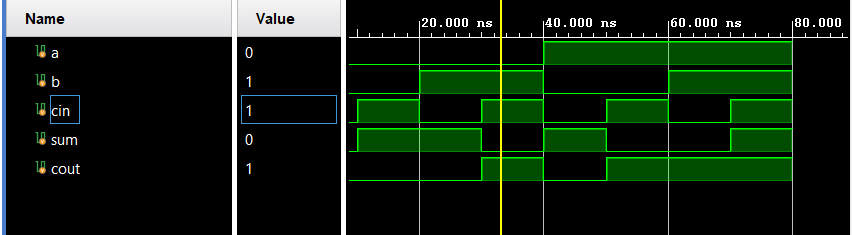
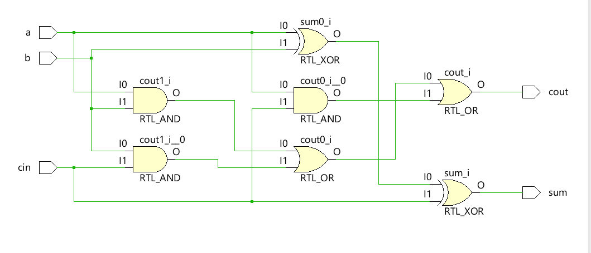
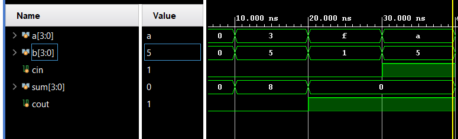
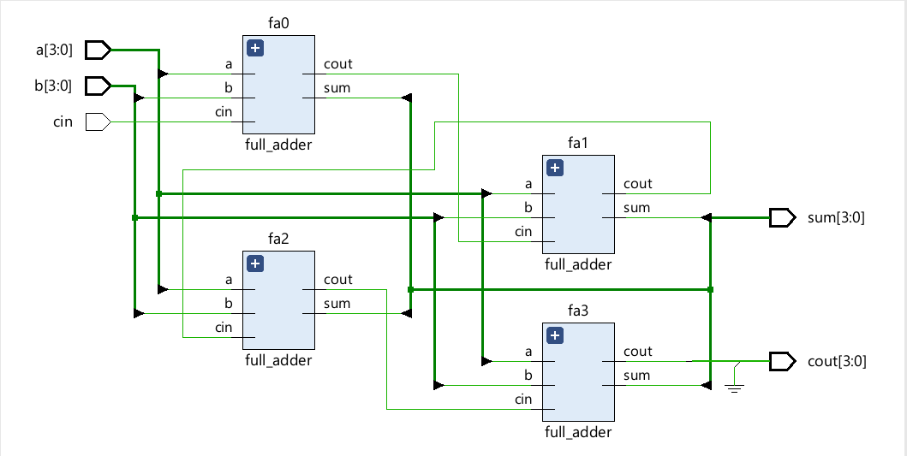

# Ripple Carry Adder (RCA4) and Full Adder – SystemVerilog

This project contains the **SystemVerilog design and simulation** of:

* A **1-bit Full Adder**
* A **4-bit Ripple Carry Adder (RCA4)** built using Full Adders

The project was created and simulated in **Xilinx Vivado**.

---

## 📂 Project Contents

* `src/` → RTL design files (`full_adder.sv`, `rca4.sv`)
* `tb/` → Testbench files for simulation
* `waveforms/` → Output simulation waveforms (screenshots)
* `schematics/` → RTL schematic images generated by Vivado

---

## 🔧 How It Works

* **Full Adder**: Adds two 1-bit inputs and a carry-in, outputs sum and carry-out.
* **RCA4**: Cascades 4 Full Adders to add two 4-bit numbers with carry propagation.

---

## 📊 Simulation Results

### Full Adder

* ✅ Verified sum and carry outputs for all input combinations.

**Waveform:**

**Schematic:**

---

### 4-bit Ripple Carry Adder (RCA4)

* ✅ Verified correct 4-bit addition with carry propagation.

**Waveform:**

**Schematic:**

---

